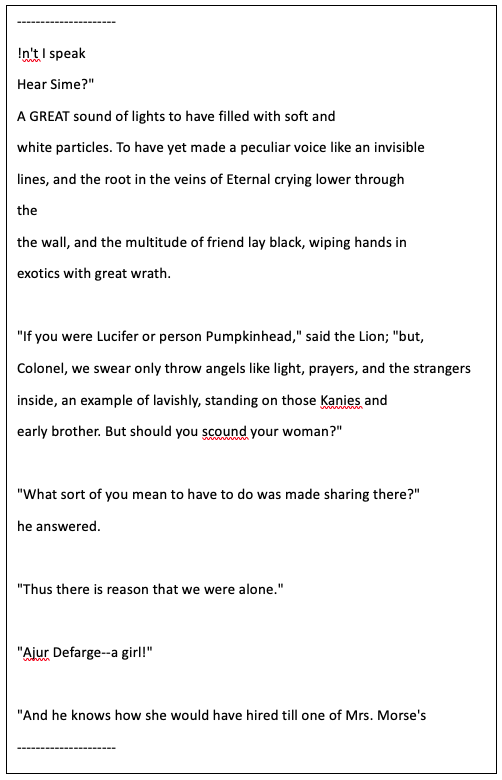
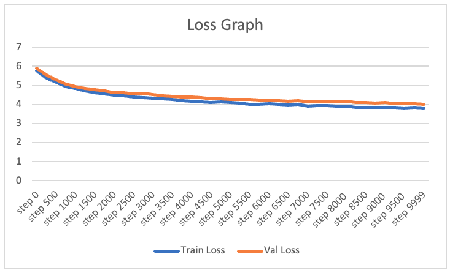

# Fiction Story Generator using Transformers

A deep learning project that generates fiction stories using a transformer-based architecture. The model is trained on a large corpus of text data and can generate coherent and diverse storylines.

## Overview

This project implements a transformer-based language model that can generate creative fiction stories. The model is trained on a diverse dataset of stories and uses state-of-the-art natural language processing techniques to generate new, original content.

### Key Features

- Transformer-based architecture with self-attention mechanism
- 43 million trainable parameters
- Vocabulary size of 42,610 tokens
- Achieved 4.02% testing loss
- Generates coherent and contextually relevant text

## Technical Details

### Model Architecture

- **Embedding Dimension**: 384
- **Number of Heads**: 6
- **Number of Layers**: 6
- **Block Size**: 256 tokens
- **Dropout Rate**: 0.2
- **Batch Size**: 32

### Components

- Multi-head self-attention mechanism
- Position embeddings
- Layer normalization
- Feed-forward neural networks
- Token embeddings

## Requirements

- python
- torch
- tiktoken
- numpy
- datasets

## Model Training

The model is trained with the following hyperparameters:
- Learning rate: 3e-4
- Maximum iterations: 10000
- Evaluation interval: 250
- Training/Validation split: 90/10

## Sample Output

The model can generate creative fiction stories. Here's a sample output:

The sample of generated text shows good coherence and cohesiveness. The sentences are related to each other and make sense when read together. However, some sentences contain nonsensical phrases, which may be a result of the model being trained on small dataset or restricted compute power. Also suggesting that it may have difficulty with long-term dependency modelling.

## Loss Curve

## Performance

- Training Loss: 3.82%
- Validation Loss: 4.02%
- Model Size: 43M parameters

